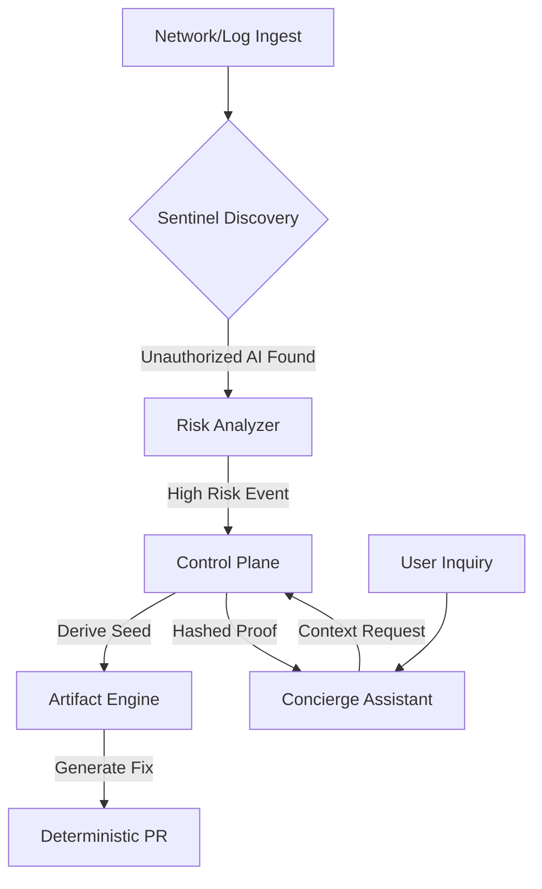

<!-- PROPRIETARY AND CONFIDENTIAL -->
<!-- Copyright © 2026 Tony Ray Macier III. All Rights Reserved. -->

# ThalosPrime-Platform

**© 2026 Tony Ray Macier III. All Rights Reserved.**

AI-native Sovereign Discovery Platform for detecting, governing, and remediating Shadow AI within enterprise networks.

## Architecture



## Quick Start
```bash
pip install -r requirements.txt
python system/orchestrator.py --seed 9876543210123456
```

## Documentation
- [Architecture](docs/ARCHITECTURE.md)
- [Governance](docs/GOVERNANCE.md)
- [Security](docs/SECURITY.md)
- [Contributing](docs/CONTRIBUTING.md)
- [Roadmap](docs/ROADMAP.md)
